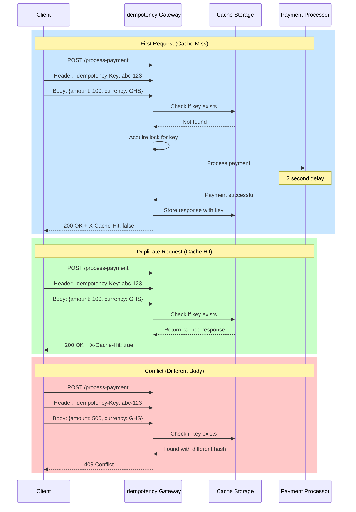
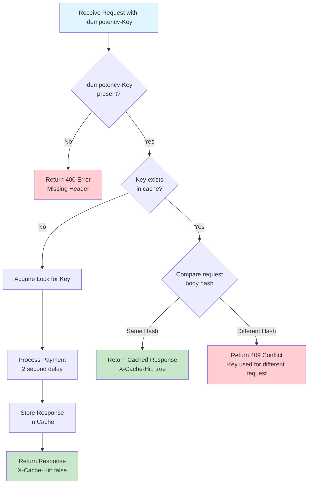
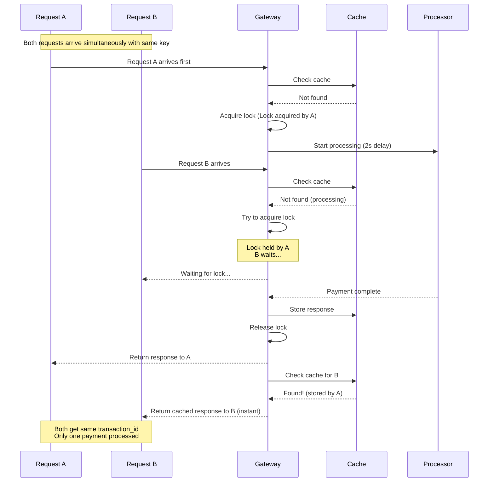

```markdown
# Idempotency Gateway - The "Pay-Once" Protocol

A production-ready idempotency layer for payment processing that ensures transactions are processed exactly once, even with duplicate requests.

## 📋 Table of Contents
- [Architecture](#architecture)
- [Features](#features)
- [Tech Stack](#tech-stack)
- [Setup Instructions](#setup-instructions)
- [API Documentation](#api-documentation)
- [Developer's Choice](#developers-choice)
- [Testing](#testing)
- [Design Decisions](#design-decisions)

## 🏗️ Architecture

### Sequence Diagram



### Flowchart Diagram



### Concurrent Request Handling



## 🚀 Features

### Core Features
- ✅ **Idempotent Processing**: Same request with same key → same response
- ✅ **Automatic Caching**: First response cached for 24 hours
- ✅ **Conflict Detection**: Different body with same key → 409 error
- ✅ **Concurrent Request Handling**: Race condition protection with locks
- ✅ **Cache Headers**: `X-Cache-Hit: true/false` for monitoring

### Developer's Choice Features
- ✅ **Request Logging**: JSON-formatted logs for audit trail
- ✅ **Metrics Endpoint**: Real-time statistics on cache performance
- ✅ **Automatic Log File**: No manual setup required

## 🛠️ Tech Stack

- **Python 3.8+** - Core language
- **FastAPI** - Web framework
- **Uvicorn** - ASGI server
- **In-memory Storage** - Simple cache (easily replaceable with Redis)

## 📦 Setup Instructions

### Prerequisites
- Python 3.8 or higher
- pip package manager

### Installation

1. **Clone the repository**
```bash
git clone https://github.com/attorney755/AmaliTech-DEG-Project-based-challenges.git
cd AmaliTech-DEG-Project-based-challenges/backend/Idempotency-gateway
```

2. **Create virtual environment**
```bash
python -m venv venv
source venv/bin/activate  # On Windows: venv\Scripts\activate
```

3. **Install dependencies**
```bash
pip install -r requirements.txt
```

4. **Run the server**
```bash
uvicorn app.main:app --reload --port 8000
```

5. **Verify it's running**
```bash
curl http://localhost:8000/
# Expected: {"message":"Idempotency Gateway Running"}
```

## 📚 API Documentation

### Endpoint: POST /process-payment

Process a payment with idempotency guarantee.

#### Headers
| Header | Required | Description |
|--------|----------|-------------|
| Idempotency-Key | Yes | Unique identifier for the request |
| Content-Type | Yes | Must be application/json |

#### Request Body
```json
{
  "amount": 100.00,
  "currency": "GHS"
}
```

| Field | Type | Constraints | Description |
|-------|------|-------------|-------------|
| amount | float | > 0 | Payment amount |
| currency | string | 3 letters | Currency code (GHS, USD, EUR) |

#### Response Codes

| Status | Description |
|--------|-------------|
| 200 OK | Payment processed successfully |
| 409 Conflict | Idempotency key used with different body |
| 400 Bad Request | Missing Idempotency-Key header |
| 422 Unprocessable | Invalid request body |

#### Response Headers
| Header | Description |
|--------|-------------|
| X-Cache-Hit | true if response from cache, false if newly processed |

#### Response Body (Success)
```json
{
  "status": "success",
  "message": "Charged 100.0 GHS",
  "transaction_id": "550e8400-e29b-41d4-a716-446655440000",
  "amount": 100.0,
  "currency": "GHS"
}
```

#### Example Requests

**First Request (Cache Miss)**
```bash
curl -X POST http://localhost:8000/process-payment \
  -H "Content-Type: application/json" \
  -H "Idempotency-Key: unique-key-123" \
  -d '{"amount": 100, "currency": "GHS"}' \
  -i
```
*Takes ~2 seconds, returns X-Cache-Hit: false*

**Duplicate Request (Cache Hit)**
```bash
curl -X POST http://localhost:8000/process-payment \
  -H "Content-Type: application/json" \
  -H "Idempotency-Key: unique-key-123" \
  -d '{"amount": 100, "currency": "GHS"}' \
  -i
```
*Instant response, returns X-Cache-Hit: true*

**Conflict Request (409 Error)**
```bash
curl -X POST http://localhost:8000/process-payment \
  -H "Content-Type: application/json" \
  -H "Idempotency-Key: unique-key-123" \
  -d '{"amount": 500, "currency": "GHS"}' \
  -i
```
*Returns 409 Conflict*

### Endpoint: GET /metrics

Get idempotency gateway statistics.

```bash
curl http://localhost:8000/metrics
```

**Response:**
```json
{
  "statistics": {
    "total_requests": 10,
    "cache_hits": 7,
    "cache_misses": 3,
    "conflicts": 1
  },
  "cache_hit_ratio": "70.00%",
  "status": "healthy"
}
```

## 💡 Developer's Choice

### Feature: Comprehensive Logging & Monitoring System

**Why this matters for FinTech:**
- **Audit Trail**: Every request is logged with timestamp for compliance
- **Performance Monitoring**: Track cache hit ratios to optimize performance
- **Fraud Detection**: Conflicts log helps detect suspicious activity

**Implementation:**
- Automatic log file creation on server startup
- JSON-formatted logs for easy parsing by monitoring tools
- `idempotency.log` contains all requests with response times
- Metrics endpoint for real-time monitoring

**Log Example:**
```json
{
  "event": "request_received",
  "idempotency_key": "abc-123",
  "request_body": {"amount": 100, "currency": "GHS"},
  "cache_status": "hit",
  "timestamp": "2026-04-30T12:30:04.108000"
}
```

## 🧪 Testing

### Manual Test Scenarios

**Test 1: First Request**
```bash
time curl -X POST http://localhost:8000/process-payment \
  -H "Idempotency-Key: test-001" \
  -H "Content-Type: application/json" \
  -d '{"amount": 100, "currency": "GHS"}'
```
*Expected: ~2 seconds response time*

**Test 2: Duplicate Request**
```bash
time curl -X POST http://localhost:8000/process-payment \
  -H "Idempotency-Key: test-001" \
  -H "Content-Type: application/json" \
  -d '{"amount": 100, "currency": "GHS"}'
```
*Expected: < 0.1 seconds (cached)*

**Test 3: Concurrent Requests**
```bash
# Run this in two terminals simultaneously
curl -X POST http://localhost:8000/process-payment \
  -H "Idempotency-Key: test-concurrent" \
  -H "Content-Type: application/json" \
  -d '{"amount": 100, "currency": "GHS"}'
```
*Expected: Both return same transaction_id*

**Test 4: Check Metrics**
```bash
curl http://localhost:8000/metrics
```

**Test 5: View Log File**
```bash
cat idempotency.log
```

## 🎯 Design Decisions

### 1. In-Memory Storage vs Redis
**Chosen**: In-memory dictionary  
**Reason**: Simpler for demonstration, easily replaceable with Redis by changing storage class

### 2. Locking Mechanism
**Chosen**: `asyncio.Lock` per idempotency key  
**Reason**: Prevents race conditions, handles concurrent identical requests

### 3. Request Body Validation
**Chosen**: SHA-256 hash comparison  
**Reason**: Fast, deterministic, prevents storing full request body

### 4. Simulated Processing Delay
**Chosen**: 2-second `time.sleep()`  
**Reason**: Demonstrates caching benefit clearly, realistic for payment processing

### 5. Logging Format
**Chosen**: JSON with timestamps  
**Reason**: Easy to parse, machine-readable for monitoring tools

### 6. Automatic Log File Creation
**Chosen**: Programmatic file creation on startup  
**Reason**: Zero manual setup for users, professional UX

## 📁 Project Structure

```
Idempotency-gateway/
├── app/
│   ├── __init__.py
│   ├── main.py           # FastAPI app & endpoints
│   ├── models.py         # Pydantic models
│   ├── storage/
│   │   ├── __init__.py
│   │   └── memory_storage.py  # Cache & locks
│   └── utils/
│       ├── __init__.py
│       └── logger.py     # Logging & metrics
├── tests/                 # Test files (to be added)
├── requirements.txt       # Dependencies
├── .gitignore            # Git ignore rules
└── README.md             # This file
```

## 📝 License

This project is developed for the AmaliTech DEG Challenge.

## 👤 Author

**attorney755**

## 🙏 Acknowledgments

- AmaliTech for the challenge
- FastAPI documentation
- Idempotency patterns in distributed systems

---
