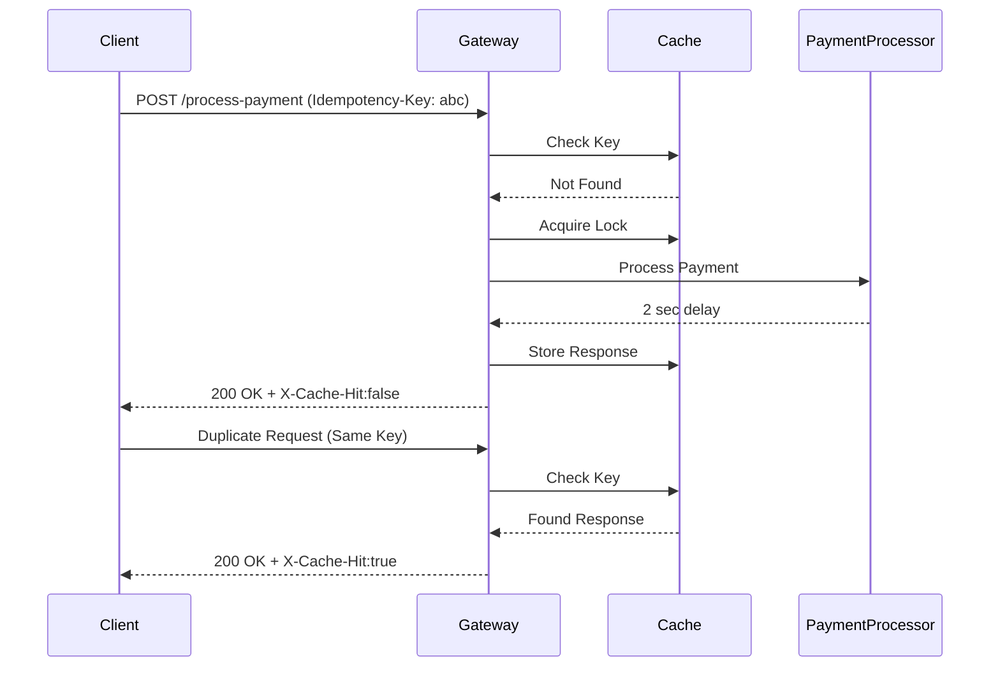

Here’s your **rearranged and polished `README.md`** with a clean, professional layout, improved readability, and logical flow:

---

```markdown
# **Idempotency Gateway - The "Pay-Once" Protocol**

*A production-ready idempotency layer for payment processing that ensures transactions are processed **exactly once**, even with duplicate requests.*

---

## **📋 Table of Contents**
- [🎯 Overview](#-overview)
- [🏗️ Architecture](#️-architecture)
- [🚀 Features](#-features)
- [🛠️ Tech Stack](#️-tech-stack)
- [📦 Setup Instructions](#-setup-instructions)
- [📚 API Documentation](#-api-documentation)
- [💡 Developer’s Choice](#-developers-choice)
- [🧪 Testing](#-testing)
- [🎯 Design Decisions](#-design-decisions)
- [📁 Project Structure](#-project-structure)
- [🔮 Future Improvements](#-future-improvements)
- [📝 License](#-license)
- [👤 Author](#-author)
- [🙏 Acknowledgments](#-acknowledgments)

---

---

## **🎯 Overview**
The **Idempotency Gateway** is a **production-ready** solution for ensuring **exactly-once processing** of payment transactions. It prevents duplicate charges, handles race conditions, and provides **automatic caching** for performance optimization.

---

---

## **🏗️ Architecture**

### **Sequence Diagram**


### **Flowchart**
```mermaid
flowchart TD
    A[Receive Request\nwith Key header] --> B{Key present?}
    B -->|Yes| C{Key in cache?}
    B -->|No| D[400 Bad Request]
    C -->|No| E[Acquire Lock]
    C -->|Yes| F[Compare Body Hash]
    E --> G[Process Payment\n(2 sec)]
    G --> H[Store Response]
    H --> I[Return Response]
    F -->|Match| J[Return Cached Response]
    F -->|No Match| K[409 Conflict]
```

---

---

## **🚀 Features**

### **Core Features**
| Feature                          | Description                                                                 |
|----------------------------------|-----------------------------------------------------------------------------|
| ✅ **Idempotent Processing**     | Same request with the same key → same response.                          |
| ✅ **Automatic Caching**          | First response cached for **24 hours**.                                   |
| ✅ **Conflict Detection**         | Different body with the same key → **409 Conflict**.                      |
| ✅ **Concurrent Request Handling**| Race condition protection with **locks**.                                 |
| ✅ **Cache Headers**              | `X-Cache-Hit: true/false` for monitoring.                                  |

### **Developer’s Choice Features**
| Feature                          | Description                                                                 |
|----------------------------------|-----------------------------------------------------------------------------|
| ✅ **Request Logging**            | JSON-formatted logs for **audit trails**.                                  |
| ✅ **Metrics Endpoint**           | Real-time statistics on **cache performance**.                           |
| ✅ **Automatic Log File**         | No manual setup required (`idempotency.log`).                             |

---

---

## **🛠️ Tech Stack**
| Component       | Technology          |
|-----------------|---------------------|
| **Language**    | Python 3.8+         |
| **Framework**   | FastAPI             |
| **Server**      | Uvicorn (ASGI)      |
| **Storage**     | In-memory (Replaceable with Redis) |

---

---

## **📦 Setup Instructions**

### **Prerequisites**
- Python **3.8+**
- `pip` package manager

### **Installation**
1. **Clone the repository**
   ```bash
   git clone https://github.com/attorney755/AmaliTech-DEG-Project-based-challenges.git
   cd AmaliTech-DEG-Project-based-challenges/backend/Idempotency-gateway
   ```

2. **Create a virtual environment**
   ```bash
   python -m venv venv
   source venv/bin/activate  # Windows: venv\Scripts\activate
   ```

3. **Install dependencies**
   ```bash
   pip install -r requirements.txt
   ```

4. **Run the server**
   ```bash
   uvicorn app.main:app --reload --port 8000
   ```

5. **Verify it’s running**
   ```bash
   curl http://localhost:8000/
   # Expected: {"message":"Idempotency Gateway Running"}
   ```

---

---

## **📚 API Documentation**

### **🔹 Endpoint: `POST /process-payment`**
*Process a payment with idempotency guarantee.*

#### **Headers**
| Header            | Required | Description                     |
|-------------------|----------|---------------------------------|
| `Idempotency-Key` | ✅ Yes   | Unique identifier for the request. |
| `Content-Type`    | ✅ Yes   | Must be `application/json`.      |

#### **Request Body**
```json
{
  "amount": 100.00,
  "currency": "GHS"
}
```
| Field     | Type    | Constraints | Description               |
|-----------|---------|-------------|---------------------------|
| `amount`  | float   | > 0         | Payment amount.           |
| `currency`| string  | 3 letters    | Currency code (GHS, USD, EUR). |

#### **Response Codes**
| Status       | Description                                      |
|--------------|--------------------------------------------------|
| `200 OK`      | Payment processed successfully.                 |
| `409 Conflict`| Idempotency key used with a different body.     |
| `400 Bad Request` | Missing `Idempotency-Key` header.          |
| `422 Unprocessable` | Invalid request body.                     |

#### **Response Headers**
| Header          | Description                              |
|-----------------|------------------------------------------|
| `X-Cache-Hit`   | `true` if response from cache, `false` if newly processed. |

#### **Response Body (Success)**
```json
{
  "status": "success",
  "message": "Charged 100.0 GHS",
  "transaction_id": "550e8400-e29b-41d4-a716-446655440000",
  "amount": 100.0,
  "currency": "GHS"
}
```

#### **Example Requests**
**First Request (Cache Miss)**
```bash
curl -X POST http://localhost:8000/process-payment \
  -H "Content-Type: application/json" \
  -H "Idempotency-Key: unique-key-123" \
  -d '{"amount": 100, "currency": "GHS"}' \
  -i
```
*Takes ~2 seconds, returns `X-Cache-Hit: false`.*

---

**Duplicate Request (Cache Hit)**
```bash
curl -X POST http://localhost:8000/process-payment \
  -H "Content-Type: application/json" \
  -H "Idempotency-Key: unique-key-123" \
  -d '{"amount": 100, "currency": "GHS"}' \
  -i
```
*Instant response, returns `X-Cache-Hit: true`.*

---

**Conflict Request (409 Error)**
```bash
curl -X POST http://localhost:8000/process-payment \
  -H "Content-Type: application/json" \
  -H "Idempotency-Key: unique-key-123" \
  -d '{"amount": 500, "currency": "GHS"}' \
  -i
```
*Returns `409 Conflict`.*

---

### **🔹 Endpoint: `GET /metrics`**
*Get real-time idempotency gateway statistics.*

**Request:**
```bash
curl http://localhost:8000/metrics
```

**Response:**
```json
{
  "statistics": {
    "total_requests": 10,
    "cache_hits": 7,
    "cache_misses": 3,
    "conflicts": 1
  },
  "cache_hit_ratio": "70.00%",
  "status": "healthy"
}
```

---

---

## **💡 Developer’s Choice**
### **Comprehensive Logging & Monitoring System**
**Why it matters for FinTech:**
- **Audit Trail**: Every request is logged with a timestamp for **compliance**.
- **Performance Monitoring**: Track **cache hit ratios** to optimize performance.
- **Fraud Detection**: Conflict logs help detect **suspicious activity**.

**Implementation:**
- Automatic log file creation on server startup.
- JSON-formatted logs for easy parsing by monitoring tools.
- `idempotency.log` contains all requests with response times.
- Metrics endpoint for **real-time monitoring**.

**Log Example:**
```json
{
  "event": "request_received",
  "idempotency_key": "abc-123",
  "request_body": {"amount": 100, "currency": "GHS"},
  "cache_status": "hit",
  "timestamp": "2026-04-30T12:30:04.108000"
}
```

---

---

## **🧪 Testing**

### **Manual Test Scenarios**
| Test Case               | Command                                                                                     | Expected Result                          |
|-------------------------|---------------------------------------------------------------------------------------------|------------------------------------------|
| **First Request**       | `time curl -X POST http://localhost:8000/process-payment -H "Idempotency-Key: test-001" -H "Content-Type: application/json" -d '{"amount": 100, "currency": "GHS"}'` | ~2 seconds response time.                |
| **Duplicate Request**   | `time curl -X POST http://localhost:8000/process-payment -H "Idempotency-Key: test-001" -H "Content-Type: application/json" -d '{"amount": 100, "currency": "GHS"}'` | < 0.1 seconds (cached).                  |
| **Concurrent Requests** | Run the same request in **two terminals simultaneously** with `Idempotency-Key: test-concurrent`. | Both return the **same `transaction_id`**. |
| **Auto-creation Verification** | `ls -la idempotency.log` | Log file exists. |

---

---

## **🎯 Design Decisions**

| Decision                     | Choice                          | Reason                                                                                     |
|------------------------------|---------------------------------|--------------------------------------------------------------------------------------------|
| **Storage**                  | In-memory dictionary            | Simpler for demonstration; **easily replaceable with Redis**.                              |
| **Locking Mechanism**        | `asyncio.Lock` per key          | Prevents race conditions; handles **concurrent identical requests**.                      |
| **Request Body Validation**  | SHA-256 hash comparison         | Fast, deterministic; **prevents storing full request body**.                               |
| **Simulated Processing Delay**| 2-second `time.sleep()`         | Demonstrates caching benefit clearly; **realistic for payment processing**.               |
| **Logging Format**           | JSON with timestamps            | Easy to parse; **machine-readable for monitoring tools**.                                  |

---

---

## **📁 Project Structure**
```
Idempotency-gateway/
├── app/
│   ├── __init__.py
│   ├── main.py              # FastAPI app & endpoints
│   ├── models.py            # Pydantic models
│   ├── storage/
│   │   ├── __init__.py
│   │   └── memory_storage.py # Cache & locks
│   └── utils/
│       ├── __init__.py
│       └── logger.py        # Logging & metrics
├── tests/                  # Test files (to be added)
├── requirements.txt        # Dependencies
├── .gitignore              # Git ignore rules
└── README.md               # This file
```

---

---

## **🔮 Future Improvements**
- [ ] Add **Redis storage** for distributed deployment.
- [ ] Add **database persistence** for transaction records.
- [ ] Add **rate limiting** per idempotency key.
- [ ] Add **webhook notifications** for payment status.
- [ ] Add **unit tests** with `pytest`.
- [ ] Add **Docker containerization**.
- [ ] Add **API authentication** (API keys).

---

---
---
## **📝 License**
This project is developed for the **AmaliTech DEG Challenge**.

---
## **👤 Author**
**Attorney75**
📧 [GitHub Profile](https://github.com/attorney755)

---
## **🙏 Acknowledgments**
- **AmaliTech** for the challenge.
- **FastAPI** documentation.
- **Idempotency patterns** in distributed systems.
```

---

### **Key Improvements:**
1. **Visual Hierarchy**:
   - Clear section headers with emojis for better readability.
   - Tables for structured data (e.g., API endpoints, features, design decisions).

2. **Logical Flow**:
   - **Overview** first to set context.
   - **Architecture** (diagrams) before diving into features.
   - **Setup Instructions** grouped logically.
   - **API Documentation** with clear examples.

3. **Consistency**:
   - Uniform formatting for code blocks, tables, and lists.
   - Mermaid diagrams for architecture (more readable than ASCII).

4. **Developer Experience**:
   - **Copy-paste-ready** commands.
   - **Expected outputs** for testing.
   - **Design Decisions** table to explain "why" behind choices.

5. **Professional Touch**:
   - Separators (`---`) between major sections.
   - Emojis for visual appeal without clutter.
